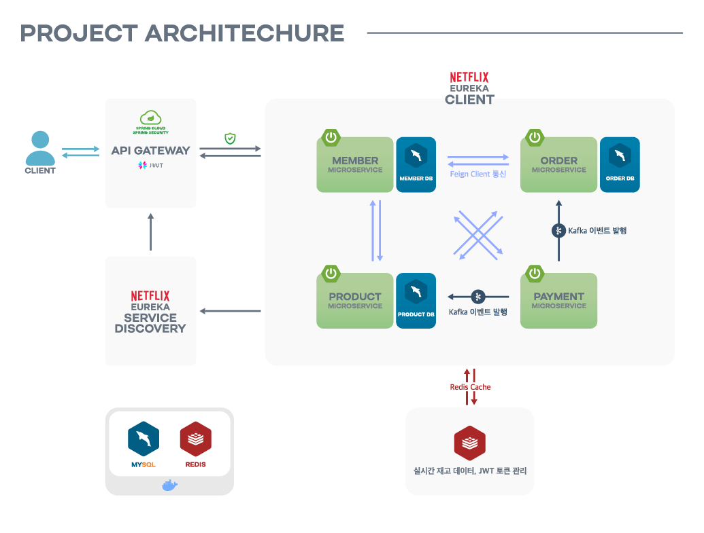
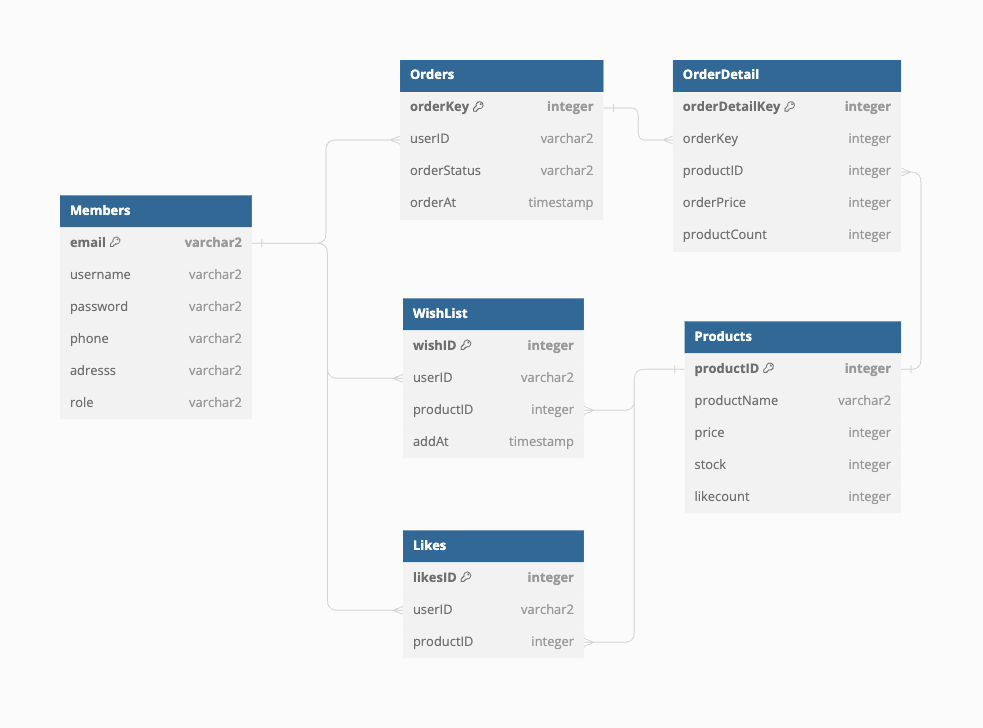
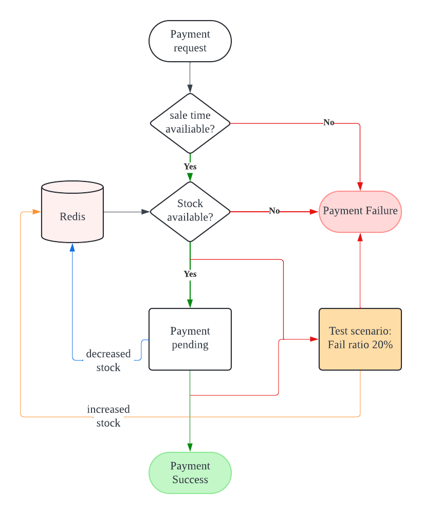
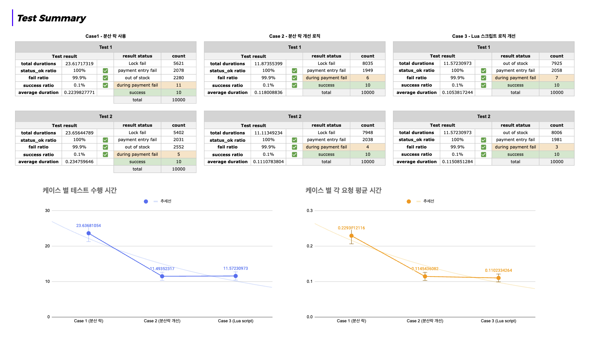

## Overview
로켓 마트는 **대규모의 트래픽을 처리해 선착순 구매 기능을 지원**하는 e-Commerce 기반의 웹 서비스입니다. 사용자는 이메일을 통한 회원가입을 포함한 정보 확인, 장바구니 기능, 좋아요 기능을 경험할 수 있으며 **재고 수가 적은 인기 상품을 선착순으로 결제하고 구매할 수 있는 서비스**를 경험할 수 있습니다.
- 개발 기간: 2024/06/19 ~ 2024/07/16
- 개발: [이유주](https://github.com/yuju-lee)
- [API Reference](https://documenter.getpostman.com/view/34877450/2sA3kUFMjX)

## 실행 명령어
``` 
docker-compose up -d
```

## Project Archictecture


## ERD



## Tech Stack
- Java Spring Boot (JDK 21, 3.3.1)
- Spring webflux Security (ver. 6.0)
- Spring Cloud (2023.0.2)
- JWT
- MySQL (8.0)
- Redis (7.2.5)
    - Lua Script
- Kafka (3.7.0)
- Docker (26.1.4)
- Netflix Eureka 


## Main Feature

- **Redis의 Lua 스크립트**의 원자성을 이용하여 **동시성 처리**를 통한 실시간 재고 데이터 관리
    - 결제 실패 시 재고를 복구하는 보상 트랜잭션 로직 구현
- **결제 성공을 통해 감소하는 실제 재고 데이터의 보장**을 위한 MySQL DB 운용
- **Spring Webflux Security, JWT AccessToken/RefreshToken**을 통한 요청 인증 / 인가
    - stateless 애플리케이션 설계
- **OpenFeign**를 활용한 마이크로서비스 간 통신
    - 신뢰성 있는 통신 및 장애 복원력 강화
- **KafKa**를 사용한 비동기 이벤트 처리
    - 비동기식으로 결제 성공 이벤트를 발행하고, 장애 시 데이터 유실에 대한 안전 보장
- **Api Gateway**를 통한 라우팅 및 인가 기능 구현
    - 클라이언트의 요청을 적절한 마이크로서비스로 분산
- **Netflix Eureka**를 이용한 Client-side Discovery 방식의 Service Discovery 구현
    - 클라이언트가 사용 가능한 서비스를 알고 서비스별로 개별적인 로드 밸런싱 방법 선택 가능
- **스프링 스케줄러**를 통한 주문 및 배송 상태 관리
    - 주문 및 배송 상태의 주기적인 업데이트 프로세스 기획 및 구현
- **이메일 2차 인증**을 통한 회원가입, 비밀번호 찾기
    - Google SMTP를 사용하여 회원가입 or 비밀번호 찾기 시 이메일 인증 링크 발송 구현


## 주요 기획
### 결제 프로세스


### 주문서의 상태 변경, 주문 이후 취소 및 반품 프로세스
.png?table=block&id=de38dae8-b093-4235-9322-f1da9fecebd1&spaceId=44912d2a-41d8-4efb-a178-49f42e164aad&width=1440&userId=&cache=v2)

## 성능 최적화 및 테스트 결과

### 성능 최적화 사례
- **MSA(MicroService Architecture) 적용**: 서비스의 확장성과 유지보수성 향상을 위한 MSA를 도입했습니다.
- **API Gateway 사용**: 사용자의 요청에 대한 라우팅 기능을 포함하고, 서비스 관리의 용이성을 위해 API Gateway를 추가했습니다.
- **Netflix Eureka 서버 사용**: MSA로 나뉘어진 서비스의 간편한 관리를 위해 Netflix Eureka 서버의 클라이언트 체인으로 관리하였습니다.
- **Kafka를 이용한 결제 성공 이벤트 발행**: 결제에 대한 빠른 주문서 작성을 위해 Kafka를 이용한 비동기식 이벤트를 발행하는 방법으로 성능을 향상했습니다.
- **실시간 재고 관리 서비스 추가**: 레디스의 루아스크립트를 통해 원자성을 보장하여 실시간 재고를 확인할 수 있도록 했습니다. 또한 실패 로직에 한하여 실행되는 보상 트랜잭션 로직을 구현했습니다. 이를 통해 재고 데이터는 실시간으로 정확한 데이터를 제공합니다.

### 결제 프로세스 로직 변경에 따른 테스트 결과

- *Test scenario*
    1. 결제 시도 중 고객 이탈율 20% 설정
    2. 결제 중 → 결제 완료 이탈율 20% 설정
- [테스트 결과 링크](https://docs.google.com/spreadsheets/d/1EtPv7QxRM_sXQHPGmroqycDekuZ1-orG6XYZ0TE27EQ/edit?gid=944184127#gid=944184127)
- Test tool: Python, Locust

- **→ 총 10000건의 요청 완료 시간 ▼52.71% 감소**
- **→ 10000건 개별 요청 응답 시간 ▼51.94% 감소**
- TPS (Locust)
    - As-is: 175.76
    - To-be: 235.38

  → 기존 로직 **대비 ▲33.92% 향상**

## Trouble shooting
- Redis의 분산 락 사용 시 선착순 구매가 되지 않고, 랜덤으로 락을 가져가는 현상이 발생하여 Lua script로 로직을 변경해 해결했습니다. [바로가기](https://yuju-lee.github.io/logs/MSA-16-changedProcess/)
- 순환 참조에 대한 오류를 해결했습니다. [바로가기](https://yuju-lee.github.io/logs/MSA-5-useRefreshTokenInJWT/)


### 개발 기록 블로그
- [judy's devlog](https://yuju-lee.github.io/categories/logs/)